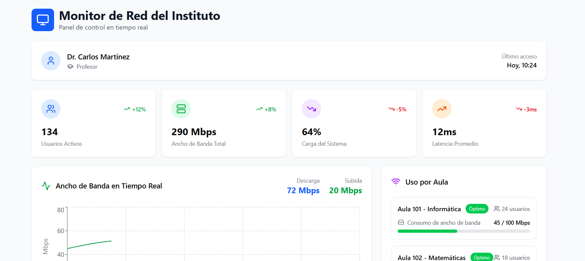
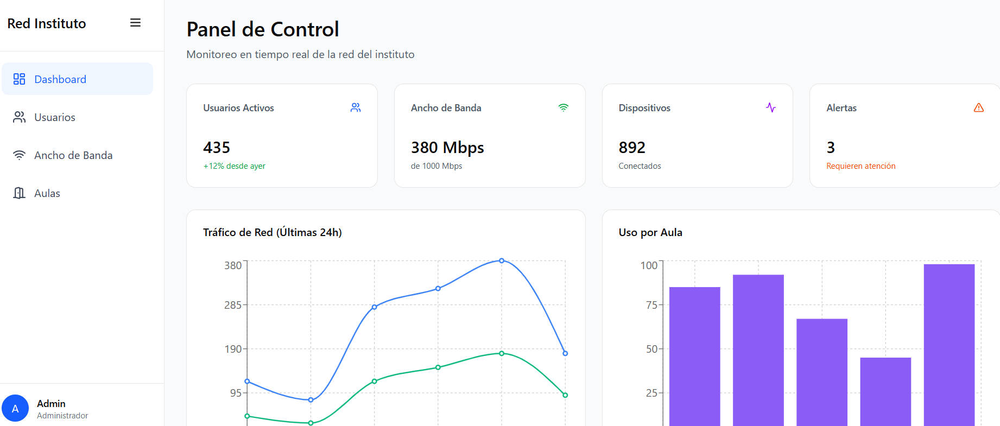

# Reto-ODS4-WebSostenible

\# Proyecto Web: Hnet -ODS 4

Este proyecto es una propuesta tecnológica para mejorar la calidad educativa

(ODS 4) desde la perspectiva del Desarrollo de Aplicaciones Web (DAW).

\---

\## 1. Análisis del Problema y Sostenibilidad

\*Azul\*

\### La conexión a internet

Hemos detectado un problema constante en nuestra educacion en algo tan inprescindible como la conexion a internet, esta funciona lentamente impidiendo realizar ciertas tareas y acciones

\### Nuestra solucion (Impacto ODS 4)

Hemos pensado en una aplicacion de gestion de un servidor escalable para la red del instituto permitiendo un mayor control y una mayor estabilidad

## 2. Arquitectura de la Solución Web
*(Responsable: José Roberto)*
### Funcionalidades Principales
Nuestra plataforma web permitirá:
- **Control de velocidad:** La aplicación de la red permitirá a los docentes controlar la velocidad de la red ya sea para limitarla o solo ver el estado de esta 
- **Usuarios:** Esta red contara con un sistema de usuarios y contraseñas para evitar conexiones indeseadas
- **Monitorización:** Los usuarios con ciertos permisos podrán monitorizar la actividad que transcurre en la red
### Entidades de Datos Básicas
Para que esta web funcione en el servidor, necesitaremos almacenar al menos la siguiente información:
- `Usuarios` Se necesitara el rol del usuario para saber si es docente o alumno, el correo de este para usarlo como nombre de usuario y una contraseña.
- `[Entidad 2]` Se almacenaran los datos de los usuarios y la actividad realizada en las ultimas horas de cada usuario

A continuación se muestra el *wireframe* de la pantalla principal de nuestra
aplicación web, diseñada para verse en un navegador de escritorio:

A continuacion otro prototipo

